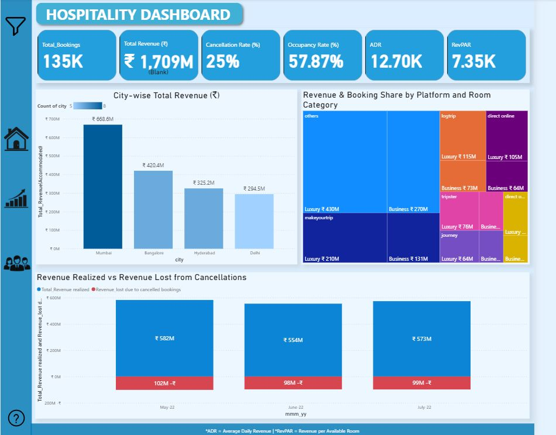
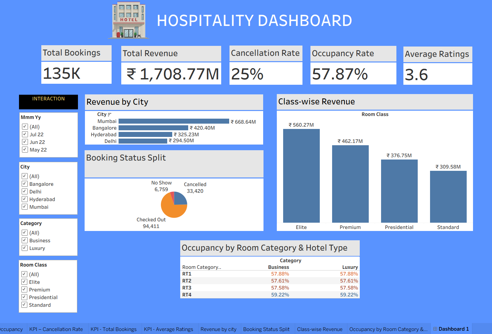
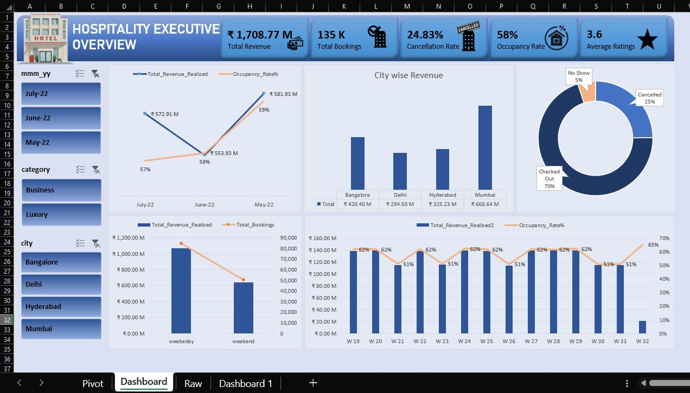

# Hospitality Analytics Project

## Project Overview

This project analyzes hotel booking and revenue data using SQL, Excel, Tableau, and Power BI. The objective is to generate business insights related to revenue performance, occupancy, booking trends, and customer behavior.

Tools Used
-SQL (MySQL)
-Microsoft Excel
-Tableau
-Power BI

Key KPIs
-Revenue
-Total Bookings
-Occupancy Rate
-ADR (Average Daily Rate)
-RevPAR
-Cancellation Rate
-Average Rating

Dashboard Features
-Revenue Analysis by City
-Revenue Trends by Month
-Booking Status Distribution
-Occupancy Analysis
-Hotel Performance Analysis
-Interactive Filters

Dataset
-dim_date
-dim_hotels
-dim_rooms
-fact_bookings
-fact_aggregated_bookings

Skills Demonstrated
-Data Cleaning
-SQL Querying
-KPI Development
-Data Visualization
-Dashboard Design
-Business Analytics

## Dashboard Preview

### Power BI Dashboard

### Tableau Dashboard

### Excel Dashboard

